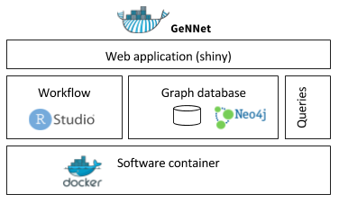
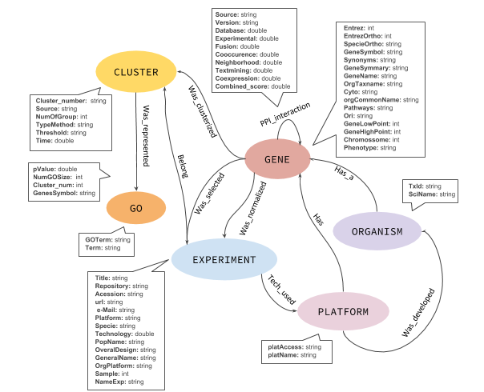
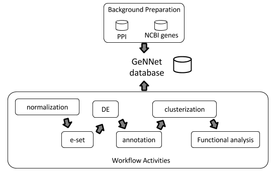

# GeNNet: An Integrated platform for unifying scientific workflow management and graph databases for transcriptome data analysis


_Raquel L. Costa_ and _Luiz Gadelha_ and _Marcelo Ribeiro-Alves_ and _Fabio Porto_ 

_National Laboratory for Scientific Computing (LNCC),_
_National Laboratory of Cancer (INCA),_
_National Institute of Infectology, Oswaldo Cruz Foundation (Fiocruz)_

e-mail: quelopes@gmail.com

## References
doi: https://doi.org/10.1101/095257

## Run the GeNNet 

1 - Pull our Docker image from Dockerhub
```
$ docker pull quelopes/gennet
```

2 - Run the Docker image   

```
$ docker run -d -p 8787:8787 -p 3838:3838 -p 7474:7474 -v dir/Data:/home/rstudio -v dir/Results/:/home/rstudio quelopes/gennet
```
3 - Open browser

3.1 - User-friendly, set parameters
```
localhost:3838/gennet
```
3.2 - RStudio
```
localhost:8787
```
3.3 - Using the graph database (Neo4j)
```
localhost:7474
```

## **Licence**

GNU GENERAL PUBLIC LICENSE version 3 by Free Software Foundation, Inc. converted to Markdown. Read the original GPL v3.

# **About**

GeNNet is a platform to execute experiments using transcriptome data, specially developed for analyzing microarray platforms currently available for human, rhesus, mice and rat. The structure is composed by three different parts: **A** -- A user-friendly Shiny-based web interface to the workflow experiment; **B** -- Accessing the resulting gene interaction graph database using Neo4j and **C** -- Executing or editing the workflow experiment using RStudio (for advanced users and developers). Figure 1 (below) describes the GeNNet architecture.




#### **ARCHIVES** 

Before starting the `gennet` software container in Docker the user needs to upload the raw data and pheno data description. To do so, the user needs to create a directory with the name of the experiment (for instance `GSE28619`) and create two subdirectories within this directory. The first directory should be named `Data` and the pheno data description should be copied to it as comma or tab-separated values. The second subdirectory should be named `Results`, which will receive the files generated by the workflow. Within the `Data` subdirectory, another subdirectory called `CEL` should be created and all the raw data that will be analyzed should be copied to it. More details about how to prepare this archive are described bellow. 

##### **Upload Phenodata**

The pheno data is loaded when starting the GeNNet container. However, users can upload their own pheno data matrices. Separator can be choosen to be tab (\\t) or comma (,). The current matrix can be visualized in the `PhenoData` tab.

The input file must be structured using mainly two columns: a column named SETS for the experimental design, and a column named SAMPLE_NAME for the names of the files containing raw sample expression matrix data.

##### **CEL archives**

The CEL file archives are loaded when the container GeNNet is started. They contain raw data from Affymetrix microarray platforms. You can see the data uploaded accessing the tab `CEL Archives Data`.


### **A -- A user-friendly Shiny-based web interface to the workflow experiment** 

A Shiny-based web interface was developed to provide a user-friendly way to execute the workflow described above. 
We developed an easy-to-use layout for providing the parameters and automatically executing all steps of the workflow experiment.

##### **Experiment information**

This panel contains some fields for writing information about the experiment which includes `Experiment name`  and `Overall design`. We recomend using a short string in `Experiment name`. For instance GSE28619 (accession number of GEO [link](https://www.ncbi.nlm.nih.gov/geo/)) or other short denomination. Observation, the experiment name should be the same of the pheno data file prefix (e.g. if the pheno data filename is GSE3292.csv, the experiment name should be GSE28619). In `overall design` users can describe information about their experiment or copy the descriptive tag from GEO.

##### **Normalization Parameters**

`Normalization parameters` allows users to choose the method that will be applied for normalization. Currently, GeNNet contains two methods available, `mas5` and `rma`. For more details about these methods one can access the `affy` package manual in Bioconductor in [link](https://www.bioconductor.org/packages/devel/bioc/manuals/affy/man/affy.pdf).


##### **Platform parameters**

The platform parameters consist of choosing the `platform` and choosing the `organism`.
The `platform` consists of the annotation specifically developed for the microarray platform. 
Currently GeNNet contains four platforms with the corresponding number associated in the `GEO` repository. The `organism` is related with the organism of annotation in which the microarray platform was based (Human, rhesus, mice and rat) are included.


##### **Execute GeNNet!**

After the configuration of all parameters, this last step executes the GeNNet workflow. This can take some time, users can check the execution progress by accessing the tab `Console`. After the execution, the results are placed the directory `Results`, including a complete graph database for visualization, making more questions and having insights about the data.

### **B -- Access the Graph Database**

The graph database is an intuitive way for connecting and visualizing relationships. In the GeNNet platform there is an initial database defined by interactions among genes from STRING-DB. During the execution of the GeNNet workflow by shiny or RStudio, new nodes and connections are formed and added to the database. 

The database is based on a NoSQL paradigm. It was built based on Neo4j [link](https://neo4j.com/). We chose this database because it was a natural way of representing the interaction among the nodes (genes) and the nodes derived from analysis. Furthermore, this database is free to use, multiplatform and easy to use and manipulate the data. 

Although a NoSQL database has no fixed schema, we define an initial schema to help and guide the database. The graph structure is shown in Figure 2. We describe the nodes, relationships and properties associated with this model in detail below. 




##### **Genes**

The nodes `GENE` represents the gene. The information was extracted from NCBI gene, which includes entrez_Id, gene symbol, summary, chromosome position, organism taxon, etc. 

##### **Organism**

Describes the organism selected by the experiment. This node contains information including scientific name and Taxon id (TxId) from NCBI.

##### **Experiment**

The node `EXPERIMENT` contains information about the overal design, accession number from main transcriptome repositories (or other identifier). 

##### **Cluster**

`Cluster` node is associated with a set of genes which were selected in biological function enrichment analysis. This node contains information about ...

##### **GO**

The `GO` node expresses the Gene Ontologies significantly associated with the cluster node. 

##### **Platform**

The `Platform` node expresses the Gene Ontologies significantly associated with the cluster node. 

##### **Has_a**
This is a relationship among `(ORGANISM)-[Has_a]->(GENE)` 

##### **PPI**

Relationship among genes, `(GENE)-[PPI_interaction]->(GENE)`

##### **Was_clusterized**

Relationship

##### **Tech_Used**

`EXPERIMENT-[Tech_Used]-(PLATFORM)`

##### **Belong**

`(Cluster)-[Belong]-(EXPERIMENT)`

##### **Has**

`(Platform)-[HAS]-(GENE)`

##### **Was_represented**

`(CLUSTER)-[Was_represented]-(GENE)`

##### **Was_normalized**

`(EXPERIMENT)-[Was_normalized]-(GENE)`

##### **Was_selected**

Relationship

#### **Statistics**

Some basic statistics are available in `Results/GraphDB-statistics` which include number of nodes per label, number of relationships and nodes, and relationship associations.

#### **Persistence of data**

The graph database can also be accessed directly through the Neo4j interface (available at: \url{http://localhost:7474}). It is possible to query and access the database in this interface using the `Cypher` language, a declarative query language for Neo4j, or `Gremlin`, a general-purpose query language for graph databases. These query languages allows for manipulating data by updating or deleting nodes, edges and properties in the graph. Querying also allows for exploring new hypotheses. It is also possible to integrate new information from different resources that are related to the targeted experiment. `GeNNet-DB` is persistent (exported to the `Results` directory) and the resulting database is exported to a directory in the computer that runs the container. Its contents can be loaded to a similar Neo4j installation. For further details one can read the Neo4j manual. More details are available in the Neo4j manual [link](https://neo4j.com/).

### **C -- Access RStudio**

The database takes some time to initialize, it will be accessible only a few seconds after starting the container. To access Rstudio, the user needs to open the service in `http://localhost:8787` and enter both the username and password as `rstudio`.
The Figure 3 represents the workflow steps implemented in R. 



#### **Module-A** 

This module consists of different steps of analysis described below.

##### **normalization** 

This step consists in normalizing the raw data from an informed Affymetrix platform using either `RMA` or `MAS5` methods, both available in the affy package. During this step, some quality indicator plots are generated (as boxplot of probe level, Spearman correlation and density estimates) as well as a normalized matrix (log-normalized expression values).

##### **e-set**

In this step, data about the experimental design should be added along with log-normalized expression values. This generates an ExpressionSet (eSet) object, a data structure object of the S4 class used as base in many packages developed in Bioconductor transcriptome analysis. This format gives flexibility and access to existing functionality. The input file must be structured using mainly two columns: a column named `SETS` for the experimental design, and a column named `SAMPLE_NAME` for the names of the files containing raw sample expression matrix data.

##### **DE**

`Differential expression (DE)` inference analysis allows for the recognition of groups of genes modulated (up- or down-regulated) in a biological system when compared among one or more experimental conditions. In many situation this is a core step of the analysis and there are a great diversity of experimental designs (such as control versus treatment, consecutive time points, etc) allowing the inference. In our platform, we use the `limma` package to select the DE genes on single-factor experimental designs based on a gene-based hypothesis testing statistic followed by a correction of multiple testing given by the `False Discovery Rate (FDR)`. Furthermore, a subset of DE genes can be selected based on a up- and down-regulation, expressed as a logarithmic (base 2) fold-change (logFC) threshold. Results of this step are displayed as Volcano plots and Matrices containing the DE genes.

##### **annotation**

The annotation step consists of annotating the probes for the corresponding genes according to the Affymetrix platform used in the experiment. 

##### **clusterization**

This step consists in analyzing which aggregated genes have a similar pattern (or level) of expression. We incorporated clusterization analysis including hierarchical methods, k-medoids from the package `PAM` (Partitioning Around Medoids) and `WGCNA` (Weighted Gene Coexpression Network Analysis).

##### **Functional analysis**

In the genes grouped by similar patterns we can identify over-represented (enriched) biological processes (`BP`). In our approach we conducted enrichment analyses applying hypergeometric tests (with p-value < 0.001) as implemented in the GOStats package. The universe is defined accrding to the Affymetrix platform selected, or, in case of multiple platforms in a single experiment design, the universe is defined as the common and unique genes among all Affymetrix platforms. The subset, geneset, is defined either by the set of diferentially expressed (DE) genes between a test and a control condition (control versus treatment design), or by the union of the DE genes selected among the pairwise comparisons among groups in all other single-factor experimental designs. Ontology information for the gene and universe sets is extracted from the Gene Ontology Consortium database `(GO)`.

### **Results**
During the workflow execution (in RStudio or Shiny) a set of results are written in the directory `Results` which ensures the re-use and persistence of data. 


